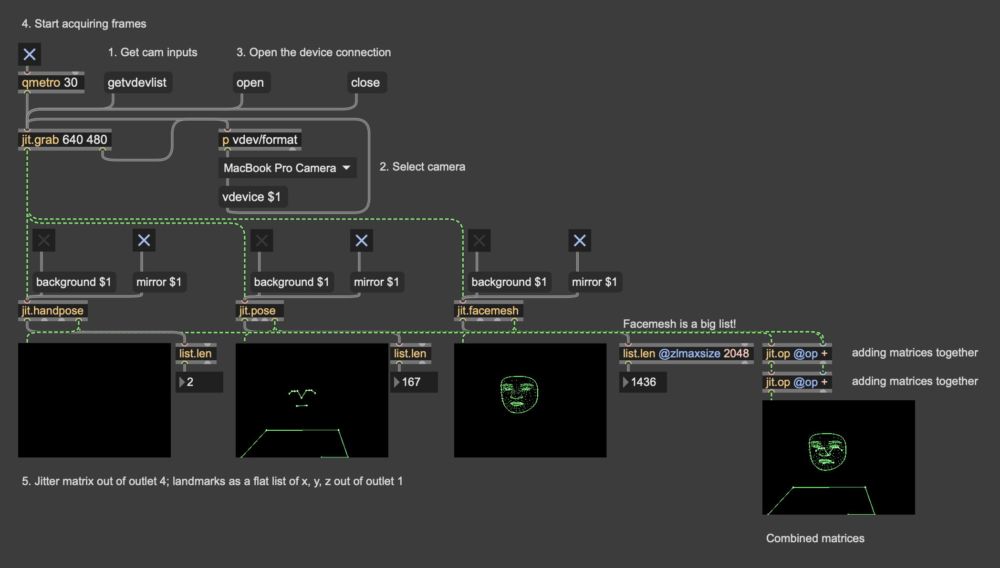

# JitTrackers

This package provides native Apple-silicon Max 9 externals for Google's
MediaPipe Hand, Pose, and Face Landmarkers: `jit.handpose`, `jit.pose`, and
`jit.facemesh`. They run directly on incoming Jitter matrices without Python,
Node, a browser, or a network service at runtime.

## Install

Copy the extracted package directory to:

```text
~/Documents/Max 9/Packages/JitTrackers
```

Restart Max, then open any of the three help files. The package contains all
three externals, models, the unified MediaPipe runtime, and its two private
OpenCV libraries. Remove older copies of `jit.handpose.mxo` from Max's search
path before installing this combined package.

## jit.handpose

```text
[jit.grab]
     |
[jit.handpose 2]
     |          |          |          |
 landmarks    world     metadata   annotated matrix
```

The optional constructor argument is the maximum number of hands, from 1 to 4.

## Input

The inlet accepts 2D `char` Jitter matrices in these conventional layouts:

- 4-plane ARGB (normal Jitter video)
- 3-plane RGB
- 1-plane grayscale, expanded internally to RGB

Input is horizontally mirrored before inference by default, matching a webcam
or selfie-camera view. Send `mirror 0` to use the original orientation.

Only the newest waiting frame is retained. If inference is slower than the
camera, older waiting frames are dropped to keep interaction latency low.

## Output

Left outlet:

```text
landmarks <hand-index> <x0> <y0> <z0> ... <x20> <y20> <z20>
clear <timestamp-ms>
```

Coordinates are normalized image coordinates. The 21 points use MediaPipe's
standard wrist/thumb/index/middle/ring/pinky ordering.

Middle outlet:

```text
world <hand-index> <x0> <y0> <z0> ... <x20> <y20> <z20>
clear <timestamp-ms>
```

World coordinates are MediaPipe's metric hand coordinates.

Right outlet:

```text
hands <count> <timestamp-ms>
handedness <hand-index> <Left|Right> <score>
status <ready> <active> <processing> <received> <processed> <dropped> <code> <text>
```

Rightmost fourth outlet:

```text
jit_matrix <name>
```

This is a 4-plane ARGB matrix with the 21 joints and standard hand-skeleton
connections. By default its background is transparent, so it contains only the
annotation. Send `background 1` to include a copy of the exact frame used for
inference. It stays synchronized with the landmark messages and can connect
directly to `jit.pwindow`, `jit.world`, or another matrix-processing object.

## Messages

- `start` — accept input matrices (default)
- `stop` — stop accepting matrices and clear the waiting frame
- `status` — report current state and counters
- `reset` — recreate the MediaPipe tracker
- `hands <1..4>` — change the maximum hand count and recreate the tracker
- `background <0|1>` — annotation only (default) or include the input frame
- `mirror <0|1>` — preserve orientation or mirror horizontally (default: 1)
- `thresholds <detection> <presence> <tracking>` — set three 0–1 confidence thresholds
- `model <path>` — load another MediaPipe Hand Landmarker `.task` file

Inference runs on a dedicated worker thread. All Max messages are emitted from
a low-priority Max queue, never directly from the inference thread.

## jit.pose

`jit.pose [maximum-poses]` has four outlets matching the hand object's layout:

```text
landmarks <pose-index> <x y z visibility presence> x 33
world <pose-index> <x y z visibility presence> x 33
poses <count> <timestamp-ms>
jit_matrix <name>
```

The fourth outlet draws the standard 33-point body skeleton. Its background is
transparent by default. `poses <1..4>`, `background <0|1>`, `mirror <0|1>`,
`thresholds`, `model`, `start`, `stop`, `reset`, and `status` are supported.
The bundled default is Google's Pose Landmarker Lite model.

## jit.facemesh

`jit.facemesh [maximum-faces]` also has four outlets:

```text
landmarks <face-index> <x y z> x 478
blendshapes <face-index> <name score> ...
faces <count> <timestamp-ms>
transform <face-index> <rows> <cols> <matrix-values...>
jit_matrix <name>
```

Face counts, status, and 4x4 facial transformation matrices share the third
outlet. The fourth outlet draws all face points plus the standard lips, eyes,
eyebrows, iris, and face-oval connections. `faces <1..4>` and the same common
control messages are supported. Blendshapes and transforms are enabled by
default.

## Build

To rebuild the Max externals against the included runtime, install:

- Apple-silicon Mac running macOS 13 or later
- Max 9
- CMake 3.25 or later
- Xcode Command Line Tools
- Cycling '74 `max-sdk-base`

Configure the source tree with paths to `max-sdk-base`, MediaPipe, and a
directory containing the unified runtime, models, licenses, and OpenCV dylibs:

```sh
cmake -S . -B build \
  -DMAX_SDK_BASE_PATH=/absolute/path/to/max-sdk-base \
  -DMEDIAPIPE_SOURCE_PATH=/absolute/path/to/mediapipe \
  -DRUNTIME_PACKAGE_PATH=/absolute/path/to/tracking-runtime
cmake --build build --config Release --parallel
```

The completed, ad-hoc-signed package is written to:

```text
build/package
```

## Verification

The release is checked by loading all three actual task models through the
unified C API. Native binaries are also checked for arm64 architecture,
dependencies, archive integrity, and valid ad-hoc signatures.

## Current scope

Version 1.1.0 is a macOS arm64 implementation. A Windows build needs a matching
MediaPipe DLL build and a small CMake packaging branch; the Max-facing source is
otherwise platform-neutral.

## Licensing and privacy

The original wrapper code is available under the MIT License. MediaPipe, the
three model bundles, the native inference dependencies, OpenCV, and the Max SDK
retain their respective licenses. See `LICENSE`, `THIRD_PARTY_NOTICES.md`,
`MODEL_PROVENANCE.md`, `SOURCE_OFFER.md`, and the complete `licenses` directory.

Inference is local: the objects do not transmit or save frames or tracking
results. See `PRIVACY.md` for the precise scope. Distribution requirements and
the targeted Gatekeeper workaround for this ad-hoc-signed build are documented
in `DISTRIBUTION.md`.
